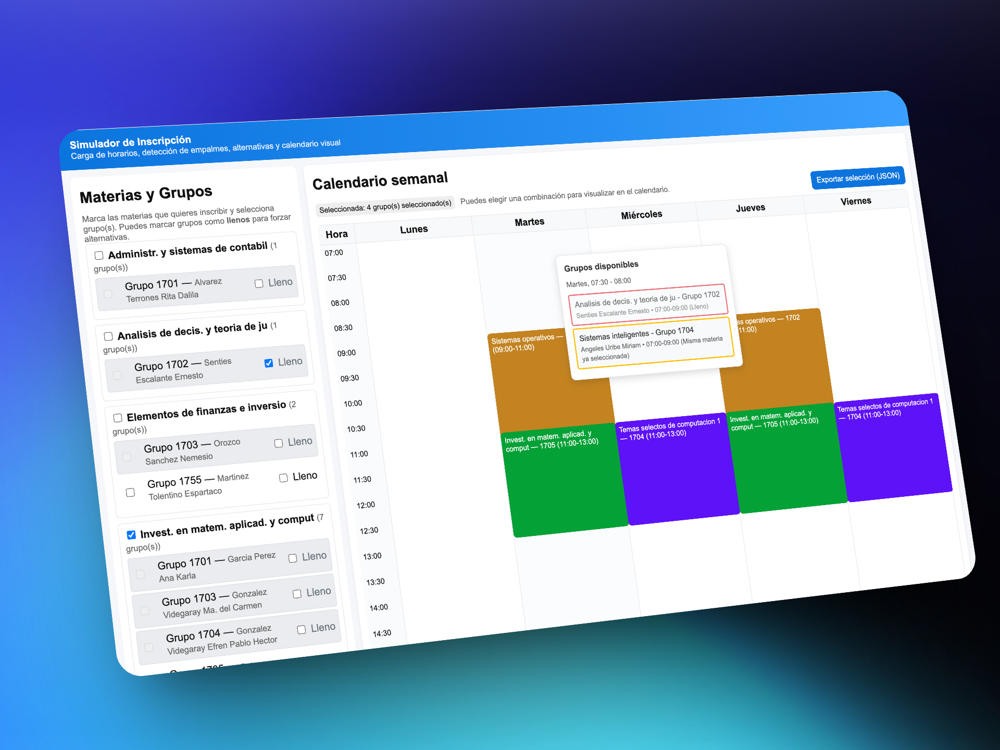

# Simulador de Inscripción de Horarios

Un simulador web interactivo y avanzado para planificar y visualizar horarios académicos con funcionalidades inteligentes. Diseñado para ayudar a estudiantes y administradores a optimizar la selección de materias evitando conflictos de horarios, con sistema de reservas, selección manual inteligente y visualización interactiva.

[](https://simulador-inscripcion-horarios.krisv.dev/)




## ¿Qué hace este proyecto?

El Simulador de Inscripción de Horarios es una herramienta avanzada que te permite:

- **Cargar datos de materias y horarios** desde un archivo JSON dinámicamente
- **Seleccionar materias y grupos** con tres modalidades distintas de selección
- **Generar combinaciones automáticamente** sin conflictos de horario con límites configurables
- **Visualizar horarios en un calendario semanal interactivo** con hover dinámico
- **Manejar grupos llenos** con sistema de reservas automáticas inteligente
- **Selección manual inteligente** con prevención automática de conflictos
- **Auto-llenado con reservas** para optimizar la selección automáticamente
- **Exportar selecciones** en formato JSON para uso posterior
- **Interfaz visual moderna** con tooltips informativos y calendario responsivo

## Características principales

### 🎯 Selección inteligente
- **Tres modalidades de selección**: Generación automática, auto-llenado con reservas y selección manual
- **Detección automática de conflictos** entre horarios en tiempo real
- **Prevención inteligente de empalmes** durante la selección manual
- **Sistema de reservas avanzado** para manejar grupos llenos automáticamente
- **Límites configurables** de combinaciones para optimizar rendimiento

### 📅 Visualización interactiva
- **Calendario semanal visual** responsivo (Lunes a Viernes, 7:00-22:00)
- **Códigos de color únicos** generados automáticamente por materia
- **Tooltips informativos** con hover que muestran grupos disponibles por horario
- **Información detallada** de profesores, grupos y disponibilidad en tiempo real
- **Indicadores visuales** de estado (disponible, lleno, seleccionado)

### ⚡ Funciones avanzadas interactivas
- **Selección manual inteligente** que deshabilita automáticamente grupos conflictivos en tiempo real
- **Auto-llenado con reservas** que optimiza la selección evitando conflictos cuando es posible
- **Sistema inteligente de grupos llenos** con simulación realista de indisponibilidad
- **Prevención automática de conflictos** durante la selección individual de grupos
- **Reglas de negocio aplicadas** (un grupo por materia, no grupos llenos, etc.)
- **Exportación completa en JSON** de configuraciones para reutilización y backup
- **Carga dinámica asíncrona** de datos desde archivos JSON externos
- **Interfaz completamente responsive** con diseño moderno, accesible y optimizado
- **Sistema de tooltips avanzado** con información contextual y posicionamiento inteligente
- **Algoritmo de backtracking optimizado** para generación eficiente de miles de combinaciones

## Estructura del proyecto

```
horarios/
├── index.html                              # Aplicación principal interactiva
├── horarios.json                           # Datos de materias y horarios
├── app.png                                 # Captura de pantalla de la aplicación
└── README.md                              # Este archivo
```

## Estructura del archivo JSON

El archivo `horarios.json` contiene un array de objetos, donde cada objeto representa un grupo específico de una materia:

```json
[
  {
    "materia": "Nombre de la materia",
    "grupo": "Código del grupo (ej: 1701)",
    "horarios": [
      {
        "dia": "Día de la semana (LU/MA/MI/JU/VI)",
        "inicio": "Hora de inicio (HH:MM)",
        "fin": "Hora de fin (HH:MM)"
      }
    ],
    "profesor": "Nombre del profesor"
  }
]
```

### Ejemplo práctico:

```json
{
  "materia": "Sistemas operativos",
  "grupo": "1702",
  "horarios": [
    { "dia": "MA", "inicio": "09:00", "fin": "11:00" },
    { "dia": "JU", "inicio": "09:00", "fin": "11:00" }
  ],
  "profesor": "Loza Pacheco Dulce Lourdes"
}
```

### Códigos de días:
- `LU`: Lunes
- `MA`: Martes  
- `MI`: Miércoles
- `JU`: Jueves
- `VI`: Viernes

## Cómo usar el simulador

### 1. Preparación inicial
1. Asegúrate de tener el archivo `horarios.json` en la misma carpeta que el HTML
2. Abre `index.html` en tu navegador
3. La aplicación cargará automáticamente los datos y estará lista para usar

### 2. Selección de materias y grupos
- **Marca las materias** que quieras inscribir usando los checkboxes principales
- Cada materia muestra cuántos grupos tiene disponibles
- **Marca grupos específicos** usando los checkboxes individuales para selección manual
- **Marca grupos como "llenos"** para simular indisponibilidad y forzar alternativas

### 3. Modalidades de selección (¡3 formas diferentes!)

#### Modalidad A: Generación automática de combinaciones
1. Marca las materias deseadas (sin seleccionar grupos específicos)
2. Haz clic en **"Calcular combinaciones"**
3. El sistema generará automáticamente todas las combinaciones posibles sin conflictos
4. Navega por la lista de combinaciones y selecciona la que prefieras
5. Visualiza la combinación seleccionada en el calendario interactivo

#### Modalidad B: Auto-llenado inteligente con reservas
1. Marca las materias deseadas
2. Haz clic en **"Auto llenar (con reservas)"**
3. El algoritmo inteligente seleccionará automáticamente los primeros grupos disponibles sin conflictos
4. Si encuentra conflictos inevitables, agregará grupos adicionales como "reservas"
5. Ideal para obtener una selección rápida y optimizada

#### Modalidad C: Selección manual inteligente
1. **No uses los botones automáticos** - selecciona grupos individualmente
2. Marca directamente los checkboxes de los grupos específicos que deseas
3. **El sistema es inteligente**: automáticamente deshabilita grupos conflictivos en tiempo real
4. Solo puedes seleccionar un grupo por materia (regla automática)
5. Los grupos marcados como "llenos" no pueden seleccionarse
6. Perfecto para cuando sabes exactamente qué grupos quieres

### 4. Visualización interactiva y exploración
- **Calendario semanal dinámico** con tu selección actual en colores únicos por materia
- **Hover sobre cualquier horario** para ver tooltips informativos con:
  - Grupos disponibles en ese momento
  - Estado de cada grupo (disponible, lleno, seleccionado)
  - Detalles de profesores y horarios específicos
- **Indicadores visuales** de estado en tiempo real

### 5. Exportación y gestión
- **"Exportar selección (JSON)"** para guardar tu configuración completa
- **"Limpiar selección manual"** para resetear toda la selección manual
- **Toggle de límite de combinaciones** (recomendado: 2000 para mejor rendimiento)

## Configuración avanzada y características técnicas

### Límite de combinaciones inteligente
- **Por defecto**: 2000 combinaciones para rendimiento óptimo
- **Configurable**: Puedes desactivar el límite para explorar hasta 50,000 combinaciones
- **Recomendación**: Mantener activado para mejor experiencia de usuario
- **Algoritmo**: Utiliza backtracking optimizado para generar combinaciones eficientemente

### Sistema avanzado de grupos llenos
Marca cualquier grupo como "lleno" para:
- **Excluir automáticamente** de todas las generaciones automáticas
- **Simular escenarios reales** de inscripción universitaria
- **Forzar el sistema de reservas** para probar alternativas
- **Prevenir selección manual** de grupos no disponibles
- **No afecta otros grupos** - solo el específicamente marcado

### Funcionalidades interactivas del calendario
- **Hover dinámico**: Muestra información detallada de grupos en tiempo real
- **Tooltips informativos**: Incluyen estado, profesor y horarios específicos
- **Colores automáticos**: Generación de colores únicos por materia usando hash
- **Responsive design**: Adaptable a diferentes tamaños de pantalla
- **Visualización en tiempo real**: Actualización instantánea con cada selección

## Casos de uso típicos

### Para estudiantes:
- **Planificación semestral**: Diseña tu horario ideal con múltiples alternativas
- **Optimización de tiempo**: Encuentra la mejor combinación evitando tiempos muertos
- **Visualización clara**: Ve tu carga académica semanal de forma intuitiva
- **Gestión de backup**: Ten alternativas listas en caso de grupos llenos
- **Selección precisa**: Elige grupos específicos con profesores preferidos
- **Simulación realista**: Prueba diferentes escenarios antes de la inscripción oficial

### Para administradores académicos:
- **Análisis de conflictos**: Identifica empalmes en la programación institucional
- **Optimización de recursos**: Distribuye grupos para maximizar inscripciones
- **Planificación estratégica**: Evalúa capacidades y demanda por horarios
- **Simulación institucional**: Modela diferentes escenarios de oferta académica

## Resolución de problemas

### "Error al cargar horarios.json"
- **Ubicación**: Verifica que el archivo esté en la misma carpeta que `index.html`
- **Formato**: Asegúrate de que el JSON tenga la estructura correcta
- **Permisos**: Ejecuta desde un servidor web local si es necesario
- **Debugging**: Revisa la consola del navegador (F12) para detalles específicos

### "No hay combinaciones sin empalmes"
- **Reducir materias**: Disminuye el número de materias seleccionadas simultáneamente
- **Gestión de grupos llenos**: Desmarca algunos grupos marcados como "llenos"
- **Verificar disponibilidad**: Asegúrate de que haya al menos un grupo disponible por materia
- **Usar reservas**: Prueba el auto-llenado con reservas para soluciones alternativas

### Rendimiento lento o navegador no responde
- **Límite activado**: Mantén el límite de 2000 combinaciones habilitado
- **Selección gradual**: Reduce materias y aumenta progresivamente
- **Usar auto-llenado**: Considera usar la función automática en lugar de generar todas las combinaciones
- **Navegador actualizado**: Usa versiones recientes de Chrome, Firefox o Safari

### Problemas de visualización
- **Zoom del navegador**: Asegúrate de que esté al 100%
- **Resolución**: Funciona mejor en pantallas de al menos 1024px de ancho
- **JavaScript habilitado**: Verifica que esté activado en la configuración del navegador

## Personalización y adaptación

Para adaptar el simulador a tu institución específica:

### Datos académicos
1. **Actualiza `horarios.json`** con tus materias, grupos y profesores específicos
2. **Mantén la estructura JSON** definida para compatibilidad completa
3. **Incluye todos los horarios** de cada grupo para detección correcta de conflictos

### Configuración de horarios
- **Rango de horas**: Modifica las constantes de tiempo en el código (líneas 667-668)
  - Por defecto: 7:00 AM a 10:00 PM
  - Intervalos: 30 minutos por slot
- **Días de la semana**: Actualmente soporta Lunes a Viernes (LU-VI)

### Personalización visual
- **Colores**: El sistema genera automáticamente colores únicos por materia
- **Estilos**: Personaliza el CSS en la sección `<style>` del archivo `index.html`
- **Responsive**: El diseño se adapta automáticamente a diferentes pantallas
- **Tema**: Fácil modificación de variables CSS para cambiar la apariencia completa

## Tecnologías utilizadas

### Core Technologies
- **HTML5** para la estructura semántica y moderna
- **CSS3** con Flexbox y Grid para diseño responsive avanzado
- **JavaScript ES6+** vanilla para toda la lógica, sin dependencias externas
- **JSON** para almacenamiento y estructura de datos

### Características técnicas avanzadas
- **Algoritmos de backtracking** para generación eficiente de combinaciones
- **Detección de conflictos en tiempo real** con análisis de overlapping
- **Sistema de eventos dinámicos** para interactividad responsive
- **Hover tooltips** con posicionamiento inteligente
- **Hash-based color generation** para colores únicos automáticos
- **Responsive design** con media queries y layout adaptativo

### Arquitectura del proyecto
- **Single-page application** completamente funcional
- **Separación de concerns** entre lógica, presentación y datos
- **Event-driven programming** para máxima interactividad
- **Performance optimizado** con límites configurables y rendering eficiente

## Contribuciones y mejoras futuras

Este proyecto está diseñado para ser fácilmente extensible. Ideas implementables:

### Funcionalidades próximas
- **Soporte para horarios de fin de semana** (sábados/domingos)
- **Integración con APIs** y bases de datos institucionales
- **Exportación multi-formato** (PDF, Excel, iCal)
- **Sistema de notificaciones** para cambios de horario en tiempo real
- **Modo oscuro** con toggle automático

### Mejoras técnicas
- **Progressive Web App (PWA)** para uso offline
- **Drag & drop** para reordenamiento visual
- **Filtros avanzados** por profesor, horario, modalidad
- **Comparador de horarios** lado a lado
- **Historial de selecciones** con sistema de guardado local

---

**Desarrollado por Kristoffer Van ([@im-krizox](https://github.com/im-krizox))**

*Proyecto diseñado para facilitar la planificación académica y optimizar la experiencia de inscripción de horarios universitarios. Open source bajo licencia MIT.*
